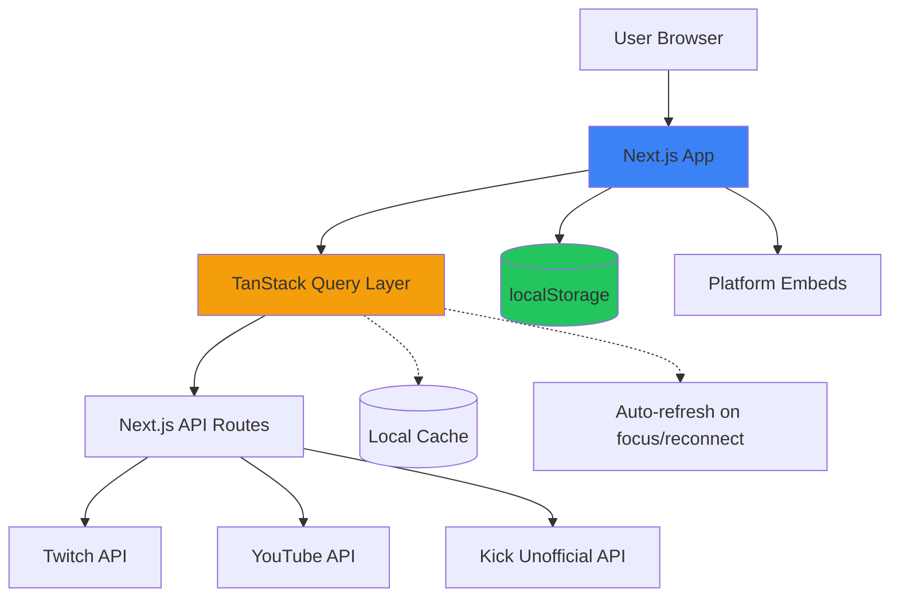
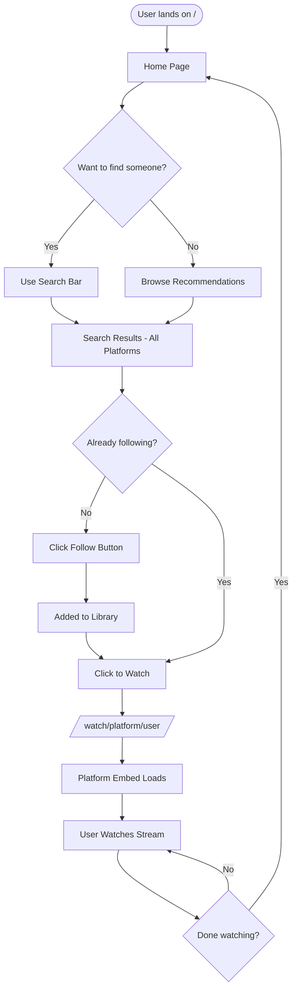

```mermaid
graph TB
    Root[Root Layout] --> Dashboard[Dashboard Layout]
    Root --> Watch[Watch Pages]

    Dashboard --> Home[Home Page]
    Dashboard --> Library[Library Page]

    Home --> CardGrid[Streamer Card Grid]
    CardGrid --> Card[Streamer Card]
    Card --> Badge[Platform Badge]
    Card --> Live[Live Indicator]
    Card --> Follow[Follow Button]

    Watch --> Embeds[Platform Embeds]
    Embeds --> TwitchE[Twitch Embed]
    Embeds --> KickE[Kick Embed]
    Embeds --> YouTubeE[YouTube Embed]

    Home --> Search[Search Bar]

    style Root fill:#1e293b
    style Dashboard fill:#334155
    style Card fill:#3b82f6
```

# Mixer - Multi-Platform Streaming Dashboard

**Design Date:** 2026-01-02
**Status:** Ready for Implementation

---

## Overview

A unified streaming dashboard that aggregates streamers across Twitch, Kick, and YouTube. Users follow *people*, not platforms. The app checks where streamers are live and provides a unified viewing experience.

**Problem Solved:** Streamers broadcast on multiple platforms (sometimes simultaneously). Viewers must check each platform individually to find where their favorite creators are streaming. Mixer solves this by unifying discovery and viewing in one place.

---

## Architecture



**Key Architectural Decisions:**
- **Local-first**: Followed creators stored in browser `localStorage`
- **Client-side rendering** for stream discovery with Server Components where beneficial
- **Next.js API routes** act as lightweight proxies (hide Twitch/YouTube credentials)
- **TanStack Query** handles caching, background refresh, and error states
- **Platform embeds** for video playback (iframe-based)

---

## Tech Stack

| Category | Technology | Purpose |
|----------|------------|---------|
| **Runtime** | Bun | Package manager, test runner |
| **Framework** | Next.js 15 (App Router) | React framework |
| **Language** | TypeScript 5.x | Type safety |
| **UI Library** | React 19.x | Latest React features |
| **Styling** | Tailwind CSS | Utility-first CSS |
| **Components** | shadcn/ui | Accessible, customizable components |
| **Icons** | lucide-react | Modern icon library |
| **Data Fetching** | @tanstack/react-query v5 | Caching, background refresh |
| **State** | zustand | Global state (followed streamers) |
| **Video Embeds** | react-youtube + raw iframes | Platform players |
| **HTTP** | axios or fetch | API calls |

---

## Data Models

```typescript
type Platform = 'twitch' | 'kick' | 'youtube';

interface Streamer {
  id: string;                    // unique ID (platform:username)
  username: string;              // display name
  platform: Platform;
  avatarUrl?: string;
  isLive: boolean;
  streamUrl?: string;            // stream URL if live
  viewers?: number;              // concurrent viewers
  thumbnailUrl?: string;         // stream preview
  title?: string;                // stream title
  category?: string;             // game/category being played
  startedAt?: string;            // ISO timestamp
  lastChecked: string;           // ISO timestamp
}

interface StoredData {
  followedStreamers: string[];   // array of streamer IDs
  followedAt: Record<string, string>; // ID -> timestamp
  settings: {
    theme: 'dark' | 'light' | 'system';
    refreshInterval: number;     // seconds
  };
}
```

---

## API Strategy

| Platform | API Approach | Authentication | Key Endpoints |
|----------|--------------|----------------|---------------|
| **Twitch** | Official Helix API | Client ID + Secret (app) | `GET /helix/streams?user_login={username}` |
| **YouTube** | YouTube Data API v3 | API Key | `GET /youtube/v3/search`, `/videos` |
| **Kick** | Unofficial API | None | `GET https://kick.com/api/v2/channels/{username}` |

**API Routes Structure:**
```
/app/api
  /twitch/route.ts        // proxy with app credentials
  /youtube/route.ts       // proxy with API key
  /kick/route.ts          // direct passthrough
  /search/route.ts        // search all platforms
```

---

## Project Structure

```
mixer/
├── app/
│   ├── (dashboard)/               # Dashboard route group
│   │   ├── page.tsx               # Home/Discovery
│   │   ├── library/page.tsx       # Followed streamers
│   │   └── layout.tsx             # Dashboard layout
│   ├── watch/
│   │   └── [platform]/
│   │       └── [username]/page.tsx  # Watch page with embed
│   ├── api/                       # API routes
│   │   ├── twitch/route.ts
│   │   ├── youtube/route.ts
│   │   ├── kick/route.ts
│   │   └── search/route.ts
│   ├── layout.tsx                 # Root layout
│   └── globals.css
├── components/
│   ├── ui/                        # shadcn/ui components
│   ├── streamer-card.tsx          # Reusable card
│   ├── platform-badge.tsx         # Platform indicator
│   ├── live-indicator.tsx         # "LIVE" pulsing dot
│   ├── search-bar.tsx             # Universal search
│   ├── follow-button.tsx          # Follow/Unfollow toggle
│   └── platform-embeds/
│       ├── twitch-embed.tsx
│       ├── kick-embed.tsx
│       └── youtube-embed.tsx
├── lib/
│   ├── api/                       # API client functions
│   ├── hooks/                     # Custom React hooks
│   ├── store.ts                   # Zustand store
│   └── utils.ts
└── types/
    └── index.ts                   # TypeScript types
```



---

## Routes

| Route | Purpose |
|-------|---------|
| `/` | Home/Discovery - Live followed + recommendations |
| `/library` | All followed streamers grid |
| `/search` | Search results page |
| `/watch/twitch/{username}` | Watch Twitch stream |
| `/watch/kick/{username}` | Watch Kick stream |
| `/watch/youtube/{channelId}` | Watch YouTube stream |

---

## Core Features

### 1. Discovery/Home
- Live followed streamers (auto-refreshing)
- Random recommendations per platform
- Category/game display on cards (no category browsing yet)
- Quick search access

### 2. Search
- Universal search bar (all platforms)
- Grouped results by platform
- One-click follow from search results

### 3. Follow System
- Follow/unfollow any streamer
- Persists to `localStorage`
- No account required
- Follow button state persists

### 4. Watch Experience
- Platform embed with chat
- Stream info (title, viewers, category)
- Direct link to original platform

### 5. Library
- All followed streamers
- Live status indicators
- Sort/filter options



---

## Multi-Platform Handling

**When a streamer is live on multiple platforms:**
- Show **separate cards per platform**
- User can see viewer counts and choose
- Easiest implementation for MVP
- Future improvement: Group by person with platform selector

---

## Error Handling

| Scenario | Handling |
|----------|----------|
| Streamer not found | Error state with "Not found" message |
| API rate limit | Fallback to cached data + toast notification |
| Platform API down | Graceful degradation, retry button |
| No search results | Empty state with suggestion to try different query |
| Embed fails to load | "Stream unavailable" + link to original platform |
| localStorage full | Quota exceeded alert |
| Network offline | Cached data + "Offline mode" indicator |

**TanStack Query Config:**
- Retries: 3
- Stale time: 1 minute
- Cache time: 5 minutes
- Global error toast on failure

---

## Theme

- **Default**: Dark mode
- **System preference**: Respects OS setting
- **Toggle**: Deferred to future improvement
- **Implementation**: shadcn/ui theme provider with `next-themes`

---

## Cut Corners (Future Improvements)

| Corner | Current Approach | Future Improvement |
|--------|------------------|-------------------|
| Live status updates | TanStack Query background refetch | WebSocket connections for real-time |
| Authentication | App credentials only | Full OAuth (Twitch/YouTube login) |
| Platform support | 3 platforms | Add Trovo, Facebook Gaming, etc. |
| Chat | Platform embed chat | Unified chat overlay |
| Notifications | None | Browser push notifications |
| Category browsing | Display only (search-based) | Full category directory with filtering |
| Multi-platform cards | Separate cards per platform | Grouped by person with platform selector |
| Recommendations | Random | Algorithm based on viewing history/follows |

---

## Implementation Checklist

- [ ] Project setup (Bun + Next.js + TypeScript + Tailwind)
- [ ] shadcn/ui installation and configuration
- [ ] TanStack Query setup
- [ ] Zustand store for followed streamers
- [ ] localStorage utilities
- [ ] API route proxies (Twitch, YouTube, Kick)
- [ ] Platform API clients
- [ ] Search API (all platforms)
- [ ] Streamer card component
- [ ] Platform badge component
- [ ] Live indicator component
- [ ] Follow button component
- [ ] Platform embed components
- [ ] Home/Discovery page
- [ ] Library page
- [ ] Search functionality
- [ ] Watch pages
- [ ] Error handling and loading states
- [ ] Dark theme configuration
- [ ] Environment variable setup

---

## Environment Variables

```env
# .env.local
TWITCH_CLIENT_ID=your_client_id
TWITCH_CLIENT_SECRET=your_client_secret
YOUTUBE_API_KEY=your_api_key
```

---

## Next Steps

1. **Set up for implementation** - Use git worktree for isolated development
2. **Create detailed implementation plan** - Break down into tasks
3. **Build core features** - Start with search + follow + watch flow
4. **Test and iterate** - Manual QA with real streamers
5. **Deploy** (optional) - Vercel or similar when ready
